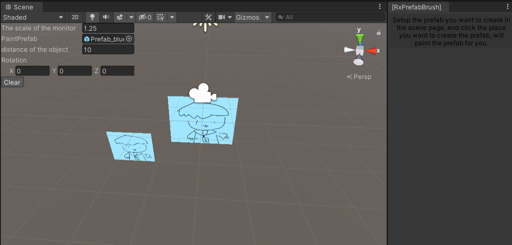
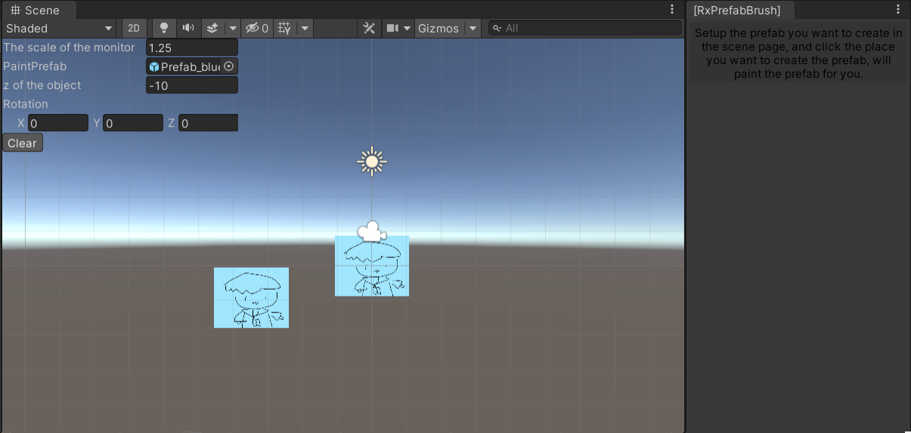
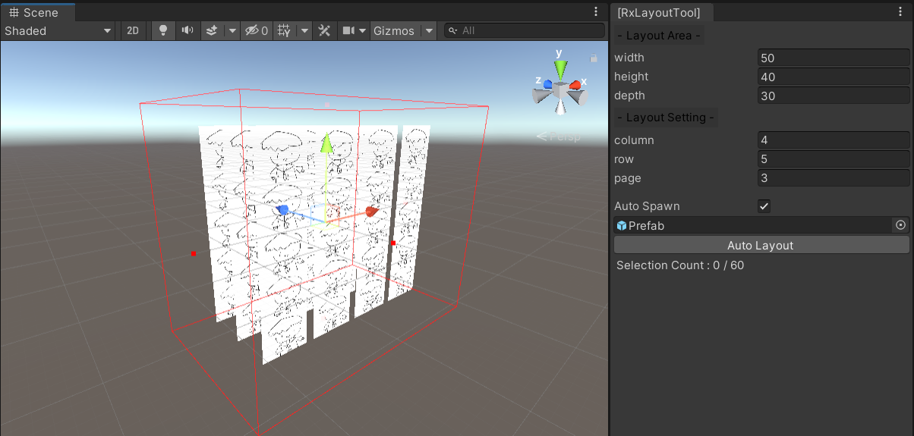

# Unity-PrefabBrush

### This is a Unity plugin can paint the prefab in the Scene window, and also layout game objects.

- Open the PrefabBrush tools in **Menu -> RxToolBox -> PrefabBrush**

## PrefabBrush
### 3D Mode

1. Setup the **PaintPrefab**, will generate a \_\_track\_\_ object for you, and will track your mouse position with **distance**.
2. Click **mouse left key** will paint the prefab.
3. Click **Clear** will reset the **PaintPrefab**.

### 2D Mode

1. Setup the **PaintPrefab**, will generate a \_\_track\_\_ object for you, and will track your mouse position with **z** value.
2. Click **mouse left key** will paint the prefab.
3. Click **Clear** will reset the **PaintPrefab**.

---

## LayoutTool

1. You can modify the **area** of the layout in the **Scene** window, or via the **RxLayoutTool** window.
2. Setup the **column(x), row(y) and page(z) in the **RxLayoutTool** window.
3. You can select gameobjects or auto generate the gameobjects(prefabs) by the LayoutTool **(turn on the Auto Spawn)**, you can also see the selection status.
4. Click **Auto Layout** will apply the layout to the gameobjects.
